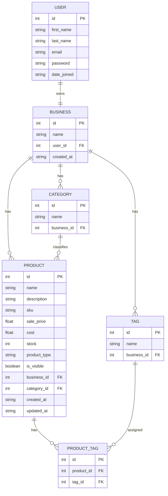

# ER Diagram - Keskinube Backend

## Diagrama Entidad-Relación

```mermaid
erDiagram

    USER ||--|| BUSINESS : owns
    BUSINESS ||--o{ CATEGORY : has
    BUSINESS ||--o{ PRODUCT : has
    BUSINESS ||--o{ TAG : has
    CATEGORY ||--o{ PRODUCT : classifies
    PRODUCT ||--o{ PRODUCT_TAG : has
    TAG ||--o{ PRODUCT_TAG : assigned

    USER {
        int id PK
        string first_name
        string last_name
        string email
        string password
        string date_joined
    }

    BUSINESS {
        int id PK
        string name
        int user_id FK
        string created_at
    }

    CATEGORY {
        int id PK
        string name
        int business_id FK
    }

    PRODUCT {
        int id PK
        string name
        string description
        string sku
        float sale_price
        float cost
        int stock
        string product_type
        boolean is_visible
        int business_id FK
        int category_id FK
        string created_at
        string updated_at
    }

    TAG {
        int id PK
        string name
        int business_id FK
    }

    PRODUCT_TAG {
        int id PK
        int product_id FK
        int tag_id FK
    }
```